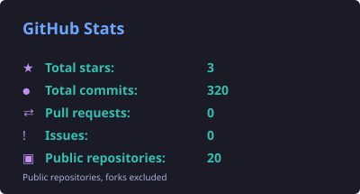
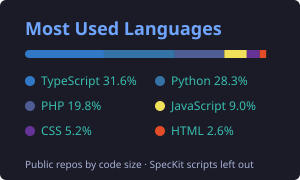

# Hi, I'm Muhammad Yaseen 👋

### AI Engineer — I build multi-agent systems that ship to production 🚀

I don't just prompt LLMs. I architect **teams of AI agents** that negotiate, veto each other, and
keep a human in the loop — then I deploy them live.

The thing I care most about: **the guarantee lives in the code, never in the model.** A model can
write the explanation; it does not get to be the reason you trust the number.

---

## ⭐ Start here — Aurum Rails

**[aurum-rails-uae-remittance](https://github.com/my5757980/aurum-rails-uae-remittance)** — UAE →
Global remittance settled on Arc in seconds, with every fee visible before you commit.

▶ **[Live app](https://aurum-rails-uae-remittance.vercel.app)** · 🎬 **[2-min demo](https://streamable.com/wutq5h)** · ⛓️ **[A real transfer this app made](https://explorer.testnet.arc.io/tx/0x16f0e66d18a0c17f3619a966721001355735a2b49c2712eeba970c864b7db699)** — settled in 3.6 s

Why this one, out of everything below:

- It **refuses its own easy pitch.** The obvious story is "remittances are expensive" — for the
  UAE corridor that is not true, so the README says so and competes on transparency instead.
- The **FX spread is displayed even when it is 0.00%** — showing the zero is what proves the line
  is real.
- There is a **"what is real vs. simulated" table on the front page**, listing what is *not* built
  (AED pay-in, KYC/AML) as prominently as what is.
- Money is `bigint` minor units with branded types, not floats — because the sample it was forked
  from used floats, and that is not acceptable in a payment path.

`Next.js 16 · Circle DCW · CCTP v2 · Arc Testnet · PostgreSQL`

---

## 🔨 Other work

**Agent systems**

| Project | What it does |
|---|---|
| ⚖️ [Contract Redline War Room](https://github.com/my5757980/contract-redline-warroom) | 5 agents redline contracts over [Band](https://www.band.ai/). Compliance holds a **veto** that forces a visible re-plan; the human holds the only key. SHA-256 hash-chained audit trail you can verify from the UI. |
| 🔮 [SupplyTwin](https://github.com/my5757980/supply-chain-digital-twin) | Supply-chain digital twin for UAE SMEs — predicts disruption ≥48h ahead. The 48h guarantee and the supplier-priority rule are **deterministic code**, re-checked at the API boundary; the LLM only supplies confidence and wording. Postgres RLS with `FORCE`, fails closed, with tests for the 48h floor, RLS and tenant isolation |
| 📡 [Maya — CS Health Radar](https://github.com/my5757980/maya-cs-health-radar) | Churn-risk agent that cites its evidence. Health score is **deterministic TypeScript**; a Postgres CHECK constraint makes an ungrounded recommendation impossible to save. Nothing is ever sent — the safety boundary is enforced by absence. **[Live](https://eonhw2qcm2ajxbmcp3jdtvopw.nativelyai.app)** |
| 📊 [CompeteIQ](https://github.com/my5757980/competitive-intel-agent) | 4-step GTM intelligence pipeline — Bright Data (Web Unlocker, SERP API, Web Scraper API) pulls live web data, Groq writes the brief, and every result names the source that really served it |
| 📄 [DocuMind AI](https://github.com/my5757980/documind-ai) | 4-agent CrewAI document pipeline — a vision agent (Kimi K2.5) plus reader, analyst and reporter agents (DeepSeek V3.1), served through Fireworks |
| 🎯 [AMD Track 1 router](https://github.com/my5757980/amd-hackathon-track1) | Token-efficient routing agent — Tier 0 solves what it can at **zero tokens**, and falls through rather than guess |
| 🛡️ [PolicyForge](https://github.com/my5757980/policyforge) | Plain English → security policy YAML with Gemini; test attacks are checked against the active policies for real, and the compliance report ticks nothing without evidence |
| 💸 [AgentFlow](https://github.com/my5757980/arc-hackathone) | Agent-to-agent USDC nanopayments on Arc L1 — sub-cent per task, every x402 payment verified on-chain |

**Tools I publish**

| | |
|---|---|
| 🔌 **3 MCP servers live on npm** | [`x-growth-mcp`](https://www.npmjs.com/package/@mj4384963/x-growth-mcp) (X · 7 tools) · [`linkedin-growth-mcp`](https://www.npmjs.com/package/@mj4384963/linkedin-growth-mcp) (LinkedIn · 3 tools) · [`threads-growth-mcp`](https://www.npmjs.com/package/@mj4384963/threads-growth-mcp) (Threads · 5 tools) |

**Product & web**

| | |
|---|---|
| 💼 [Office CRM](https://github.com/my5757980/office-crm) | Back office for a used-vehicle export business — lead → invoice → payment → unit → export documents. Next.js 16 · PostgreSQL |
| 🏘️ [TokenEstate](https://github.com/my5757980/tokenestate-rwa-platform) | Real estate tokenization — ERC-1155 fractional ownership, soulbound KYC checked on every transfer, on-chain rent. 71 tests |
| 🤖 [Physical AI & Humanoid Robotics](https://github.com/my5757980/PhysicalAIHumanoid) | Interactive textbook with a RAG chatbot — grounded answers, cited sections, EN ↔ اردو |

---

## 🛠️ Tech Stack

Everything below runs in at least one of my repositories.

**Agents:** CrewAI · Band SDK · MCP (I build and publish servers) · multi-agent orchestration in plain Python and TypeScript

**AI/LLM:** OpenAI SDK · Claude · Gemini · Groq · Fireworks · AssemblyAI · RAG with Qdrant · Prompt & Context Engineering

**Practices:** Spec-Driven Development — constitution → spec → plan → tasks → implement, with the artefacts committed

**Backend:** Python (FastAPI) · Node.js (NestJS) · PostgreSQL · Redis

**Frontend:** Next.js 15/16 · React 19 · TypeScript · Tailwind CSS

**Web3:** Solidity · Hardhat · The Graph · IPFS · Wagmi · OpenZeppelin · Circle (DCW, CCTP, Arc)

**DevOps:** Docker · Railway · Vercel · Supabase · Neon · GitHub Actions

---

## 📊 GitHub Stats

 

Drawn from the GitHub API by <code>.github/scripts/stats.py</code> and refreshed every week by a GitHub Action.

---

## 🤝 Connect

> *"Shipping products, not just prompts."*
